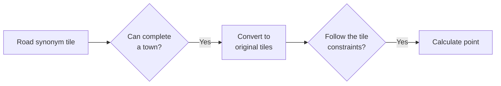

# nine_tiles_panic

This program shearch the best towns for [Nine Tiles Panic](https://oinkgames.com/en/games/analog/nine-tiles-panic/) (Oink Games, 2019) by brute-force.

This program reproduces the tiles on the code and explores towns as if players actually create towns on a table.

## Installation

```bash
git clone https://github.com/136s/nine_tiles_panic.git
cd nine_tiles_panic
conda env create --file requirements.yaml
cd nine_tiles_panic
conda activate ntp
```

## Usage

To search all possible town and calculate those towns' point, run

```bash
python -m nine_tiles_panic
```

then `success_pattern.txt` which contians town pattern and point.

To check the face of a town, run

```python
from utils import View
View("206745813361230035").draw()
```

then get bellow image.


This town can be seen at the [official site](https://oinkgames.com/images/description/nine-tiles-panic/image02.jpg).

## Class

### TileFace

### Tile

### Road

### Town

### Path

### Agent, Alien, Hamburger

## Search algorithm

Concept:


