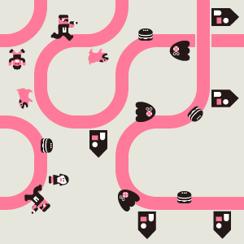
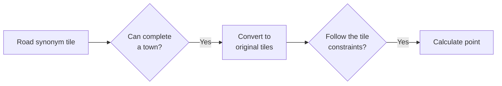
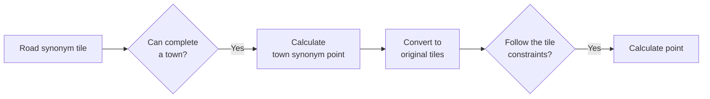

# nine_tiles_panic

This program shearches the best towns for the [Nine Tiles Panic](https://oinkgames.com/en/games/analog/nine-tiles-panic/) (Oink Games, 2019) by brute-force.

## Installation

```bash
pip install git+https://github.com/136s/nine_tiles_panic.git
```

## Usage

To search all possible town and calculate those towns' point, run

```bash
python -m nine_tiles_panic
```

then `success_pattern.db` which contians town pattern and point is created.

To check the face of a town, run

```python
from nine_tiles_panic import View
View("206745813361230035").draw()
```

then get below image.



This town can be seen at the [official site](https://oinkgames.com/images/description/nine-tiles-panic/image02.jpg).

## Classes

### TileFace

`TileFace` class has roads and the number of tile objects:

- dog
- citizen (girl)
- citizen (boy)
- house
- UFO
- agent (off road)
- alien (off road, captured)

### Tile

`Tile` class has a front face and a back face.
And this class generates tile sets:

- original tile set
- synonym tile set: five types of tiles with unique roads (used to judge if a town can be generated)

The tile number are 0 to 8.
The front face is marked `True` or "0", and the back face is marked `False` or "1".
The tile angles are 0 to 3 clockwise.

### Road

`Road` class has both initial and terminal edge of road and the road objects:

- the direction agent faces
- the direction alien faces
- number of hamburger

The edge number of roads is:

``` text
+-0-+
1   3
+-2-+
```

### Town

`Town` class has tile faces, paths (= road of town) and point calculation methods.

The tile "position" number is:

``` text
+-------+
| 0 1 2 |
| 3 4 5 |
| 6 7 8 |
+-------+
```

The tile "direction" number is:

- front face: 0 to 3 (equals to its angle)
- back face: 4 to 7 (equals to its angle + 4)

A town instance is made from the "pattern" which length is 18.
The first 9 characters represent the number of the tile to be placed in that "position", and the next nine characters represent the "direction" of that tile.

Example:

``` text
The 0-th position is #2 tile.
|
206745813361230035
         |
         The #2 tile is front face which rotates 270 degree.
```

### Path

`Path` class has both initial and terminal end of path, length and the path objects:

- agent
- alien
- hamburger

The path edge is:

``` text
+-0-+--4-+-8-+
1   3    7  11
+-2-+--6-+10-+
13  15  19  23
+-14+-18-+22-+
25  27  31  35
+-26+-30-+34-+
```

Difference between `Road` and `Path`:

- `Road`: tile roads to be used for judging to complete a town
- `Path`: town roads used to calculate scores for completed town

### Agent, Alien, Hamburger

`Agent` class has its face and whether it is captureing an alien.

`Alien` class has its face, whether it is captured by an agent and whether it is eating a hamburger.

`Hamburger` class has whether it is eaten by an alien.

### View

`View` class draws a tile face or a town.
If the input is `TileFace` or `Town`, draw pseudo image by its infomation.
If the input is `string`, draw real image by the string.

## Search algorithm

### A. Search all pattern

Pattern combinations: $9!\times8^9 = 48{,}704{,}929{,}136{,}640$

```python
from nine_tiles_panic import Search, Town
for pattern in Search.search_all():
    points = Town(pattern).get_theme_point()
    print(pattern, points)
```

### B. Search by road synonym

Synonym pattern combinations: [$254{,}088$](./tests/expected/synonym_pattern.txt)

```python
from nine_tiles_panic import Search
for pattern, points in Search.search_point():
    print(pattern, points)
```

Concept:



### C. Search by road synonym and calculate points at each steps

```python
from nine_tiles_panic import Search
for pattern, points in Search.search_point_2step():
    print(pattern, points)
```

Concept:


